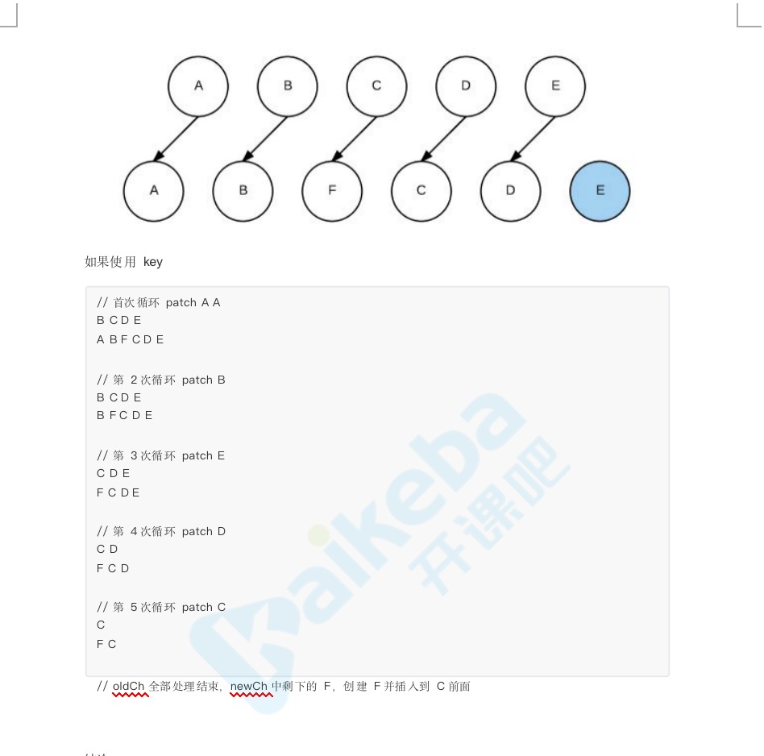

<h1 align="center">简易三问</h1>

## 1. v-if和v-for同时出现，哪个优先级更高？
### 源码：compiler/codegen/index.js
``` javascript
  <p v-for="item in items" v-if="show">
```
### 结论：
1. 同级情况下v-for优先于v-if被解析。从生成的渲染函数render中可以看出来。
2. 如果同时出现，每次渲染都会先执行循环再去判断条件，浪费性能。
3. 要避免这种情况，则在外层嵌套template，在这一层进行v-if判断，内部v-for循环。

## 2. Vue中的data选项为什么必须是个函数而Vue根实例则没有这个限制？
### 结论：
vue组件可能存在多个实例，如果使用对象定义data，则会导致他们共用一个data对象，
那么状态变更将会影响所有组件实例，采用函数形式在initData时会将其作为工厂函数
返回全新data对象，有效规避多实例之间的污染，而根实例只有一个，不需要这样做。


## 3. vue中key的作用和功能原理？
### 结论：
* key的作用主要是为了更加高效的更新虚拟DOM，其原理是vue在patch过程中通过key可以精准判断两个节点是否是同一个，从而避免频繁更新不同元素，使整个patch过程更加高效，减少DOM操作，提高性能。
* 不设置key还可能引发列表更新时的一些隐藏bug，比如错误删除某个元素(前提循环中的子元素不依赖原数组的value)。
 ``` javascript
  <body>
  <div id="app">
    <ul>
      <li v-for="(value, index) in arr" :key="index">
        <test />
      </li>
    </ul>
    <button @click="handleDelete">delete</button>
  </div>
  </div>
</body>
<script>
  new Vue({
    name: "App",
    el: '#app',
    data() {
      return {
        arr: [1, 2, 3]
      };
    },
    methods: {
      handleDelete() {
        this.arr.splice(0, 1);
      }
    },
    components: {
      test: {
        template: "<li>{{Math.random()}}</li>"
      }
    }
  })
</script>
// 本应该删除元素1，但是却删除了元素3，因为做sameNode判断时认为新的数组[2,3]和旧数组[1,2,3]中的1,2相同，最后就数组多出来一个，则干掉了3。
  
 ```
* vue在使用相同标签元素的过渡切换时也会使用key，其目的是为了让vue可以区分它们，否则vue只会替换其内部属性而不会触发过渡效果。





